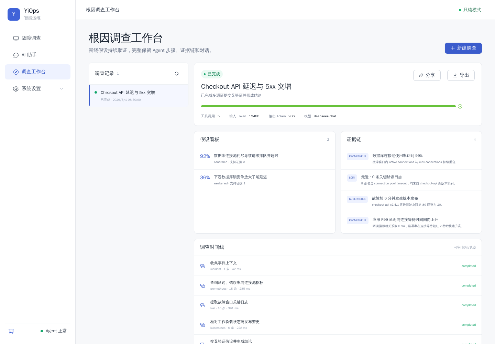
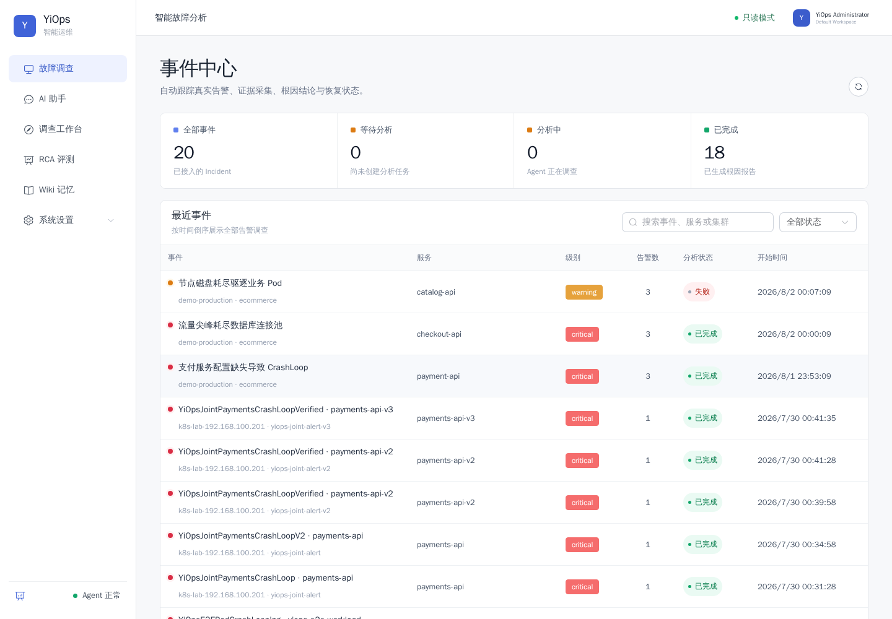
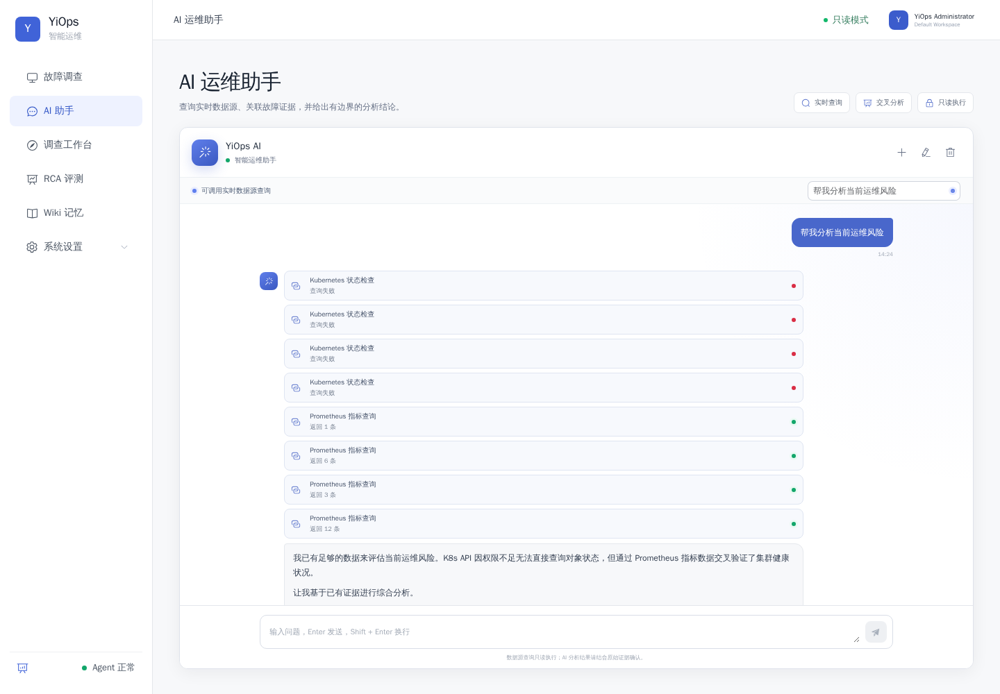
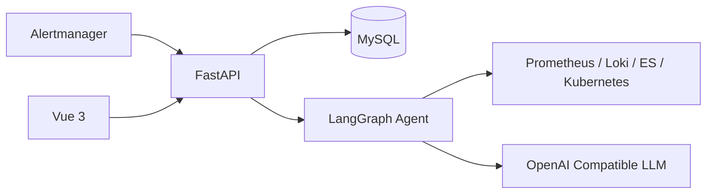

# YiOps

[](https://github.com/timmy1688/YiOps/actions/workflows/ci.yml)
[](./LICENSE)
[](./backend/pyproject.toml)
[](./frontend/package.json)

**让每一个根因结论，都能回到真实证据。**

YiOps 是面向 Kubernetes 和云原生环境的开源根因分析（RCA）平台。它接收 Alertmanager 告警，按
受控流程查询 Prometheus、Loki、Elasticsearch 和 Kubernetes，将压缩后的真实证据交给模型，生成
可追溯、可复核的中文根因报告。

> 当前版本面向单节点部署，只进行只读调查，不执行自动修复。Compose 部署默认启用管理员登录，并以
> Workspace 作为数据隔离边界。

## 核心能力

- 自动接收、去重和聚合 Alertmanager 告警；
- 使用受控 Agent 调查指标、日志、Kubernetes 状态和错误事件；
- 根因假设引用真实 Evidence，证据不足时明确拒答；
- 支持 DeepSeek 和其他 OpenAI Compatible 模型渠道；
- 提供 Incident 中心、调查工作台、AI 助手和 RCA 评测中心；
- 保存工具调用、证据、假设、时间线、Token 和模型报告；
- 使用只读查询模板、凭据加密、HttpOnly 会话和 CSRF 防护；
- 内置 20 个合成 RCA 场景和 3 个可直接导入的 Demo。

## 界面预览

### 根因调查工作台



### 事件中心



### AI 运维助手



## 工作原理



Agent 使用固定的受控流程：

```text
normalize → plan → collect → compress → refine → analyze → validate → save
```

模型负责选择调查方向、检查证据缺口和生成根因假设；Python 负责查询真实数据、压缩证据、验证引用和
限制置信度。完整原理、执行过程和技术演进见 [技术文档](./docs/README.md)。

## 快速部署

需要 Linux、Docker Engine 和 Docker Compose v2：

```shell
git clone https://github.com/timmy1688/YiOps.git
cd YiOps
./service.sh install
```

安装脚本会构建服务、启动 MySQL、执行数据库迁移，并生成随机数据库密码和管理员密码。密码保存在权限为
`600` 的 `.env.docker` 中。

启动后访问：

- Web：`http://127.0.0.1:8100/`
- OpenAPI：`http://127.0.0.1:8100/docs`
- 就绪检查：`http://127.0.0.1:8100/api/v1/health/ready`

常用命令：

```shell
./service.sh status
./service.sh logs
./service.sh restart
./service.sh stop
```

容器内可通过 `host.docker.internal` 访问宿主机数据源。公网部署前必须增加 HTTPS 和网络访问控制，并将
`YIOPS_AUTH_COOKIE_SECURE` 设置为 `true`。

直接执行 `docker compose up -d --build` 只适合本机体验：它使用示例数据库密码且默认不开启登录。
正式部署应使用 `./service.sh install` 或显式配置 `.env.docker`。

## 配置

### 模型

在 Web 的“模型接入”页面添加 OpenAI Compatible 渠道，填写 Base URL、模型名称和 API Key，测试后
设为当前渠道。API Key 使用 `.runtime/credential.key` 加密保存，不会通过读取接口返回。

也可以通过 `.env` 提供默认 DeepSeek 配置：

```dotenv
YIOPS_DEEPSEEK_API_KEY=
YIOPS_DEEPSEEK_MODEL=deepseek-v4-pro
YIOPS_LLM_MOCK_MODE=false
```

### 数据源

在“数据源”页面添加 Prometheus、Loki、Elasticsearch 或 Kubernetes，并使用只读凭据测试连接。

- Elasticsearch 使用只读索引权限；
- Kubernetes 使用独立 ServiceAccount 和最小 RBAC；
- kubeconfig 需要自包含 Token/CA 或客户端证书；
- YiOps 不执行 kubeconfig 中的 `exec` 插件，也不读取其中引用的本地文件；
- 凭据加密保存，原始 kubeconfig 不落库。

Kubernetes 只读 ServiceAccount 示例见
[`deploy/k8s/yiops-reader.yaml`](./deploy/k8s/yiops-reader.yaml)。

### Alertmanager

在“告警接入”页面创建集成，将生成的 Webhook URL 配置为 Alertmanager Receiver：

```yaml
route:
  receiver: yiops

receivers:
  - name: yiops
    webhook_configs:
      - url: "http://yiops.example.com:8100/api/v1/integrations/ID/webhook/TOKEN"
        send_resolved: true
```

渠道默认开启自动分析。`firing` 告警创建或更新 Incident 并触发分析；`resolved` 告警只更新状态。

## Demo 与评测

Web 的“RCA 评测”页面可以导入三个官方 Demo，也可以运行全部 20 个合成场景。命令行用法：

```shell
backend/.venv/bin/python evals/demo.py crashloop
backend/.venv/bin/python evals/demo.py db-pool
backend/.venv/bin/python evals/demo.py disk-pressure
backend/.venv/bin/python evals/run.py
```

评测覆盖根因 Top-1、证据精确率/召回率、跨数据源覆盖、幻觉、置信度、延迟和成本。外部 Agent
可以通过 `--predictions your-results.json` 导入以场景 ID 为键的预测 JSON；字段格式参考
`evals/run.py` 中 `baseline()` 的返回值。

## 开发与文档

| 文档 | 内容 |
|---|---|
| [技术文档](./docs/README.md) | Agent 原理、执行流程、证据模型和演进路线 |
| [贡献指南](./.github/CONTRIBUTING.md) | 源码运行、数据库迁移、代码检查和连接器开发 |
| [安全策略](./.github/SECURITY.md) | 漏洞报告和生产部署基线 |
| [变更记录](./CHANGELOG.md) | 版本变化 |

## 当前边界

YiOps 当前不会执行自动修复，也不能替代人工变更审批。模型结论应结合证据和现场情况由运维人员复核。
生产部署还需要 HTTPS、反向代理、网络访问控制、外部密钥托管、数据备份和审计策略。

贡献代码请阅读 [贡献指南](./.github/CONTRIBUTING.md)，安全问题请按
[安全策略](./.github/SECURITY.md) 私下报告。本项目使用 [Apache-2.0 License](./LICENSE)。
