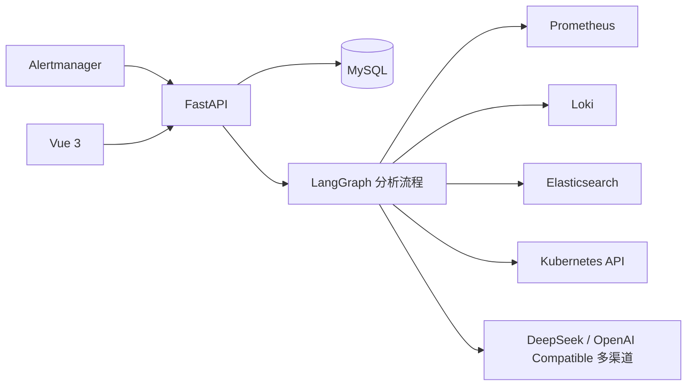

# YiOps

[](https://github.com/timmy1688/YiOps/actions/workflows/ci.yml)
[](./LICENSE)
[](./backend/pyproject.toml)
[](./frontend/package.json)
[](#docker-compose-一键部署)

**让每一个根因结论，都能回到真实证据。**

YiOps 是一个面向 Kubernetes 与云原生环境的开源智能根因分析（RCA）平台。它接收
Alertmanager 告警，按受控流程查询 Prometheus、Loki、Elasticsearch 和
Kubernetes，只把压缩后的证据交给大模型，最终生成可追溯、可复核的中文根因报告。

> 当前版本面向单节点部署，默认只进行只读调查，不执行自动修复。Compose 部署默认
> 开启管理员登录，并使用 Workspace 作为数据隔离边界。

## 主要能力

- 接收 Alertmanager Webhook，自动归并和去重告警；
- 自动聚合 Alertmanager 告警，并可按接入渠道配置自动或手动发起分析；
- 接入 Prometheus、Loki、Elasticsearch 和 Kubernetes 数据源；
- 在 Web 界面维护 DeepSeek 及其他 OpenAI Compatible 模型渠道并随时切换；
- 使用独立 AI 助手按需查询日志、指标、Kubernetes 状态和历史分析；
- 使用持久化调查工作台保存对话、工具步骤、证据、假设和时间线，支持取消、继续、分享与导出；
- 使用独立 RCA 评测中心持续衡量根因命中、证据质量、幻觉率、延迟与成本；
- 一键导入三个官方合成 Demo，新部署无需真实告警即可体验完整调查闭环；
- 使用受控的八节点流程规划查询、补充缺失证据并生成根因报告；
- 展示分析进度、工具调用、原始证据和证据引用；
- 对模型密钥及数据源凭据进行本地加密存储；
- 使用 HttpOnly 会话、CSRF 防护和 Workspace 边界保护运维数据；
- 支持分析失败重试和报告反馈。

## 界面预览

以下界面使用仓库内的合成故障案例渲染，不包含任何生产环境数据。

### 根因调查工作台

围绕候选假设持续调用 Loki、Prometheus 和 Kubernetes 等只读工具，将证据、置信度、
执行步骤和对话沉淀到一个可继续、可分享、可导出的调查空间。


### 事件中心

统一查看告警严重级别、归并后的 Incident、Agent 分析状态和根因报告完成情况。


### AI 运维助手

除了自动 RCA，也可以直接提问，让助手查询最近的 Loki 日志、Prometheus 指标、
Kubernetes 状态或历史分析，并在回答中保留工具调用记录。


## 为什么是 YiOps

| 能力 | YiOps 的做法 |
| --- | --- |
| 证据优先 | 先查询和压缩现场数据，再让模型分析；结论必须引用已保存的证据 |
| 安全可控 | 模型只能选择受控 QueryPack，默认只读，不能生成并执行任意查询或命令 |
| 多源交叉验证 | 在一个调查中关联指标、日志、Kubernetes 状态、告警与历史分析 |
| 过程可审计 | 持久化工具参数、执行状态、耗时、证据、假设和完整调查时间线 |
| 可持续评测 | 内置 20 个合成 RCA 场景和证据质量、置信度、延迟、成本等评分指标 |
| 开箱即用 | Docker Compose 一键部署，模型、数据源和告警接入均可在 Web 中配置 |

## 技术架构



后端采用 Python 3.12、FastAPI、LangGraph、Tortoise ORM；前端采用 Vue 3、
TypeScript、Vite 和 Element Plus。更完整的设计说明见
[YiOps MVP 技术落地方案](./YiOps-MVP技术落地方案.md)。

## Agent 分析流程

当前 Agent 使用固定的八节点流程：

```text
normalize → plan → collect → compress → refine → analyze → validate → save
```

模型只负责选择受控 QueryPack、进行一次证据缺口复核和生成结构化报告；实际
PromQL、LogQL、Kubernetes API 查询、证据压缩、引用验证和置信度校准均由
Python 执行。完整的触发条件、节点输入输出、证据模型、失败恢复及 Incident
关闭流程见 [Agent 分析流程](./docs/agent-analysis-flow.md)。

## 界面功能

- **告警事件**：查看事件列表、严重级别和分析状态；
- **分析详情**：查看调查步骤、证据、模型结论和处置建议；
- **AI 助手**：通过多轮对话调用只读数据源工具并分析现场问题；
- **RCA 评测**：运行 20 个固定场景，查看总体、分类和逐场景评分；
- **数据源**：添加数据源、配置只读凭据并测试连通性；
- **告警接入**：生成独立的 Alertmanager Webhook 地址；
- **模型接入**：维护多个模型渠道、测试连接并选择当前分析渠道。

## Docker Compose 一键部署

只需要 Linux、Docker Engine 和 Docker Compose v2。首次启动会自动构建前后端、
启动 MySQL、初始化数据表，并生成随机数据库密码和管理员密码：

```shell
git clone https://github.com/timmy1688/YiOps.git
cd YiOps
./service.sh install
```

启动完成后访问：

- Web：`http://127.0.0.1:8100/`
- 局域网：`http://<服务器 IP>:8100/`
- OpenAPI：`http://127.0.0.1:8100/docs`
- 就绪检查：`http://127.0.0.1:8100/api/v1/health/ready`

`service.sh` 会记录 Compose 运行模式，此后统一用它管理服务：

```shell
./service.sh status
./service.sh logs
./service.sh restart
./service.sh stop
```

首次执行会生成权限为 `600` 的 `.env.docker`，其中数据库和管理员密码均为随机值。
终端会提示管理员用户名，密码保存在 `YIOPS_ADMIN_PASSWORD`。需要修改端口、监听
地址、超时或并发数时，编辑该文件后执行 `./service.sh restart`。MySQL 不会暴露到
宿主机，数据库、运行数据和凭据加密密钥保存在 Docker Named Volume 中；普通的
`down` 不会删除数据。

也可以完全使用原生 Compose 命令。直接执行下面的命令会使用仅适合本机体验的
默认数据库密码，并且不开启登录，仅适合本机体验；正式部署请先复制
`.env.docker.example`，修改数据库与管理员密码，再加 `--env-file .env.docker`：

```shell
docker compose up -d --build
docker compose ps
```

容器内可用 `host.docker.internal` 访问宿主机，例如宿主机上的 Loki 可填写
`http://host.docker.internal:3100`。通过 `./service.sh install` 生成的认证配置默认监听
所有网卡，便于局域网评估；不带环境文件直接运行 Compose 时只绑定本机。公网部署前
仍必须增加 HTTPS 和网络访问控制，并将 `YIOPS_AUTH_COOKIE_SECURE` 设置为 `true`。

为避免 Webhook 和调查分享令牌进入日志，源码与容器启动均默认关闭 Uvicorn 访问日志；
应用错误和 Agent 执行日志仍会正常记录。

## 源码方式运行

### 1. 环境要求

- Linux；
- Python 3.12+；
- Node.js 20+ 与 npm；
- MySQL 8.0+；
- 可选：Prometheus、Loki、Elasticsearch、Kubernetes 集群和模型 API。

### 2. 初始化数据库和配置

```sql
CREATE DATABASE yiops
  CHARACTER SET utf8mb4
  COLLATE utf8mb4_unicode_ci;
```

```shell
cp .env.example .env
```

修改 `.env` 中的 `YIOPS_DATABASE_URL`。`service.sh` 会在启动前执行 Aerich 数据库迁移。
需要开启登录时，同时设置：

```dotenv
YIOPS_AUTH_ENABLED=true
YIOPS_ADMIN_USERNAME=admin
YIOPS_ADMIN_PASSWORD=请替换为至少12位的随机密码
YIOPS_AUTH_COOKIE_SECURE=false
```

通过 HTTPS 反向代理部署时，将 `YIOPS_AUTH_COOKIE_SECURE` 改为 `true`。

### 3. 安装后端

```bash
python3.12 -m venv backend/.venv
backend/.venv/bin/pip install -e "backend[dev]"
```

### 4. 构建前端

```bash
cd frontend
npm install
npm run build
cd ..
```

### 5. 启动服务

```bash
./service.sh start
./service.sh status
```

默认访问地址：

- Web：`http://127.0.0.1:8100/`
- OpenAPI：`http://127.0.0.1:8100/docs`
- 就绪检查：`http://127.0.0.1:8100/api/v1/health/ready`

常用管理命令：

```bash
./service.sh logs
./service.sh restart
./service.sh stop
```

可通过环境变量修改监听端口：

```bash
YIOPS_PORT=8200 ./service.sh start
```

## 开发模式

分别启动后端和前端：

```bash
cd backend
.venv/bin/uvicorn app.main:app --host 0.0.0.0 --port 8100 --reload
```

```bash
cd frontend
npm run dev
```

Vite 开发服务器默认运行在 `http://127.0.0.1:5173`，并把 `/api` 请求代理到
后端的 `8100` 端口。

## RCA Demo 与评测

Web 界面的“RCA 评测”菜单可以直接运行、保存并查看评测结果，也可以一键导入三个
带完整 Incident、分析报告、证据链与调查时间线的官方 Demo。仓库同时提供 20 个不包含
生产数据的合成 RCA 场景，并重点提供三个可复现 CLI Demo：
CrashLoop 配置缺失、数据库连接池耗尽、节点磁盘压力驱逐。运行方式：

```bash
backend/.venv/bin/python evals/demo.py crashloop
backend/.venv/bin/python evals/demo.py db-pool
backend/.venv/bin/python evals/demo.py disk-pressure
backend/.venv/bin/python evals/run.py
```

评测报告包含根因 Top-1、证据精确率/召回率、跨数据源覆盖、无证据声明率、
置信度 Brier 分数、延迟、工具调用和 Token 成本。也可以通过 `--predictions`
导入其他 Agent 的结果，在相同场景与评分器下横向比较。

## 数据库迁移

数据库结构由 `backend/migrations` 下的 Aerich 迁移管理。源码和 Compose 启动都会
先执行 `aerich upgrade`，生产环境关闭运行时自动建表。开发新模型后执行：

```bash
cd backend
AERICH_MYSQL_VERSION=8.0 .venv/bin/aerich migrate --name describe_change
.venv/bin/aerich upgrade
```

## 配置模型

推荐在 Web 界面的“模型接入”中配置：

1. 添加一个或多个 DeepSeek 或其他 OpenAI Compatible 模型渠道；
2. 为每个渠道填写 Base URL、模型名称和 API Key；
3. 点击“测试连接”验证渠道；
4. 将需要使用的渠道设为当前渠道（同一时间只会启用一个）。

API Key 不会返回给前端，后端会使用 `.runtime/credential.key` 加密后再保存。
该密钥文件不进入 Git，但迁移实例时需要通过安全渠道单独备份。

也可以通过 `.env` 设置默认 DeepSeek 配置：

```dotenv
YIOPS_DEEPSEEK_API_KEY=
YIOPS_DEEPSEEK_MODEL=deepseek-v4-pro
YIOPS_LLM_MOCK_MODE=false
```

不要把真实 API Key 写入 `.env.example` 或其他受 Git 管理的文件。

## 接入数据源

在“数据源”页面添加服务地址和只读凭据，然后点击连接测试。建议遵循以下原则：

- Prometheus 与 Loki 仅开放查询接口；
- Elasticsearch 使用只读索引权限；
- Kubernetes 只需填写名称并上传自包含 kubeconfig，系统会自动识别当前 context、API Server、
  集群标识、默认命名空间和认证信息；
- kubeconfig 建议使用独立 ServiceAccount 和最小化 RBAC，并内嵌 Token/CA 或客户端证书；
- 出于安全考虑，YiOps 不会执行 kubeconfig 中的 `exec` 插件，也不会读取其中引用的本地文件；
- 不要使用集群管理员 Token；
- 通过防火墙或 NetworkPolicy 限制 YiOps 来源地址。

上传后，YiOps 只保存连接所需字段；认证信息会使用 `.runtime/credential.key` 加密，原始
kubeconfig 不会落库。若 kubeconfig 的 API Server 是 `127.0.0.1` 或本机代理地址，请先改成
YiOps 服务能够访问的集群地址。

仓库提供以下 Kubernetes 示例：

- [`deploy/k8s/yiops-reader.yaml`](./deploy/k8s/yiops-reader.yaml)：只读 ServiceAccount；
- [`deploy/k8s/loki-demo.yaml`](./deploy/k8s/loki-demo.yaml)：测试用 Loki；
- [`deploy/k8s/observability-nodeports.example.yaml`](./deploy/k8s/observability-nodeports.example.yaml)：
  Prometheus 与 Loki 的受限 NodePort 示例。

新增数据源类型时，参考[数据源连接器扩展指南](./docs/connector-development.md)。内置注册表
会向 Web 界面提供连接器名称、能力、健康检查路径和凭据类型，避免前后端重复维护清单。

应用 NodePort 示例前，必须复制为本地文件并替换示例 CIDR：

```bash
cp deploy/k8s/observability-nodeports.example.yaml \
  deploy/k8s/observability-nodeports.yaml
```

`observability-nodeports.yaml` 已加入 `.gitignore`，避免提交真实网络信息。

## 接入 Alertmanager

在“告警接入”页面创建集成后，YiOps 会生成带独立令牌的 Webhook URL。将该地址
配置为 Alertmanager Receiver：

```yaml
route:
  receiver: yiops

receivers:
  - name: yiops
    webhook_configs:
      - url: "http://yiops.example.com:8100/api/v1/integrations/REPLACE_INTEGRATION_ID/webhook/REPLACE_TOKEN"
        send_resolved: true
```

保存后发送一条测试告警，即可在“告警事件”页面查看。接入渠道默认开启自动分析：
收到 firing 告警后会创建或更新 Incident，并自动启动一次分析；关闭
`auto_analyze` 后，才需要在 Incident 页面手动点击“开始分析”。resolved 告警
只更新告警和 Incident 状态，不会触发新的分析。

## 代码检查

```bash
cd backend
.venv/bin/ruff check app
.venv/bin/python -m compileall -q app
```

```bash
cd frontend
npm run typecheck
npm run build
```

## 安全说明

- `.env`、`.runtime/`、日志、缓存、虚拟环境和前端构建产物默认不会提交；
- 模型密钥和数据源凭据不会通过读取接口返回；
- Compose 默认启用 HttpOnly 会话和 CSRF 校验，管理员密码在首次部署时随机生成；
- Incident、调查、数据源、模型和告警接入按 Workspace 归属查询；
- 查询工具使用预定义模板，模型不能直接执行任意 PromQL、LogQL 或命令；
- 当前尚未提供用户邀请、角色管理和 Workspace 管理界面；
- 生产部署仍应增加 HTTPS、反向代理、网络访问控制、密钥托管、备份和审计策略。

## 项目结构

```text
YiOps/
├── backend/                  # FastAPI、Agent、连接器与数据模型
├── frontend/                 # Vue 3 Web 界面
├── docs/                     # Agent 流程和测试环境文档
├── deploy/k8s/              # Kubernetes 示例清单
├── .env.example             # 脱敏的环境变量模板
├── .env.docker.example      # Docker Compose 环境变量模板
├── Dockerfile               # 前后端多阶段镜像
├── docker-compose.yml       # YiOps 与 MySQL 编排
├── service.sh               # 单节点服务管理脚本
└── YiOps-MVP技术落地方案.md   # 详细设计文档
```

## 当前范围

YiOps 当前定位为验证告警分析闭环的 MVP。它不会执行自动修复，也不能替代人工变更
审批。模型结论应结合证据、监控数据和现场情况由运维人员复核。
