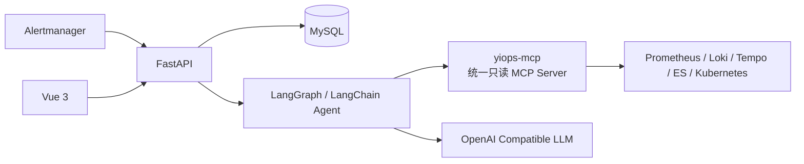

# YiOps

[](https://github.com/timmy1688/YiOps/actions/workflows/ci.yml)
[](./LICENSE)
[](./backend/pyproject.toml)
[](./frontend/package.json)

**让每一个根因结论，都能回到真实证据。**

YiOps 是面向 Kubernetes 和云原生环境的开源根因分析（RCA）平台。它接收 Alertmanager 告警，按
受控流程查询 Prometheus、Loki、Tempo、Elasticsearch 和 Kubernetes，将压缩后的真实证据交给模型，生成
可追溯、可复核的中文根因报告。

> 当前版本面向单节点部署，只进行只读调查，不执行自动修复。Compose 部署默认启用管理员登录，并以
> Workspace 作为数据隔离边界。

## 核心能力

- 自动接收、去重和聚合 Alertmanager 告警；
- 使用受控 Agent 调查指标、日志、Kubernetes 状态和错误事件；
- 使用 LangGraph 和 LangChain `create_agent` 运行有界 ReAct，并记录每轮决策摘要；
- 内置 Wiki RAG 长期记忆，可在页面维护运行手册、架构知识和历史经验；
- 根因假设引用真实 Evidence，证据不足时明确拒答；
- 支持 DeepSeek 和其他 OpenAI Compatible 模型渠道；
- 提供 Incident 中心、调查工作台、AI 助手和 RCA 评测中心；
- 保存工具调用、证据、假设、时间线、Token 和模型报告；
- 使用内置统一只读 MCP Server、查询模板、凭据加密、HttpOnly 会话和 CSRF 防护；
- 坚持框架优先：协议、Agent、Web、Schema、ORM 和 UI 使用主流实现，自研代码聚焦 RCA 领域逻辑；
- 内置 20 个合成 RCA 场景和 3 个可直接导入的 Demo。

## 界面预览

### 根因调查工作台


### 事件中心


### AI 运维助手


## 工作原理



Agent 使用有界的 ReAct 调查流程：

```text
normalize + retrieve memory → react ⇄ act/observe → analyze → validate → save
```

模型每轮只选择一个白名单 QueryPack 或停止；Python 负责执行只读查询、压缩观察、控制轮次与上下文
预算、验证引用和限制置信度。完整原理、执行过程和技术演进见 [技术文档](./docs/README.md)。

## 快速部署

需要 Linux、Docker Engine 和 Docker Compose v2：

```shell
git clone https://github.com/timmy1688/YiOps.git
cd YiOps
./service.sh install
```

安装脚本会构建镜像，启动 MySQL、`yiops-mcp` 和 YiOps API，执行数据库迁移，并生成随机数据库密码、
内部 MCP Token 和管理员密码。密钥保存在权限为 `600` 的 `.env.docker` 中。

启动后访问：

- Web：`http://127.0.0.1:8100/`
- OpenAPI：`http://127.0.0.1:8100/docs`
- 就绪检查：`http://127.0.0.1:8100/api/v1/health/ready`（同时验证 MySQL 与 `yiops-mcp`）

常用命令：

```shell
./service.sh status
./service.sh logs
./service.sh restart
./service.sh stop
```

容器内可通过 `host.docker.internal` 访问宿主机数据源。公网部署前必须增加 HTTPS 和网络访问控制，并将
`YIOPS_AUTH_COOKIE_SECURE` 设置为 `true`。

直接执行 `docker compose up -d --build` 只适合本机体验：它使用示例数据库密码且默认不开启登录。
正式部署应使用 `./service.sh install` 或显式配置 `.env.docker`。

## 配置

### 模型

在 Web 的“模型接入”页面添加 OpenAI Compatible 渠道，填写 Base URL、模型名称和 API Key，测试后
设为当前渠道。API Key 使用 `.runtime/credential.key` 加密保存，不会通过读取接口返回。

也可以通过 `.env` 提供默认 DeepSeek 配置：

```dotenv
YIOPS_MODEL_API_KEY=
YIOPS_MODEL_BASE_URL=https://api.deepseek.com
YIOPS_MODEL_NAME=deepseek-v4-pro
YIOPS_LLM_MOCK_MODE=false
```

### 数据源

在“数据源”页面填写 Prometheus、Loki、Tempo、Elasticsearch 或 Kubernetes 的原生 API 地址。
Compose 内置一个不暴露宿主机端口的 `yiops-mcp`：API 使用官方 MCP Python Client 调用固定工具，
MCP Server 再以只读请求访问原生数据源。

| 类型 | 原生只读 API | MCP 工具 |
|---|---|---|
| Prometheus | `/api/v1/query_range` | `query_prometheus` |
| Loki | `/loki/api/v1/query_range` | `query_loki_logs` |
| Tempo | `/api/search`、`/api/v2/traces/{id}` | `search_tempo_traces`、`get_tempo_trace` |
| Elasticsearch | `/{index}/_search` | `query_elasticsearch_logs` |
| Kubernetes | Pod、Workload、Node、Event GET API | `inspect_kubernetes` |

数据源认证支持无认证、Bearer Token、Basic Auth 和 API Key。Kubernetes 应使用只读
ServiceAccount/最小 RBAC；示例 RBAC 见
[`deploy/k8s/yiops-reader.yaml`](./deploy/k8s/yiops-reader.yaml)。

内部 MCP 配置：

| 环境变量 | 用途 | 默认值 |
|---|---|---|
| `YIOPS_MCP_URL` | API 访问 MCP 的 Streamable HTTP 地址 | `http://127.0.0.1:8110/mcp` |
| `YIOPS_MCP_INTERNAL_TOKEN` | API 与 MCP 共用的内部认证密钥 | 本地开发固定值；部署脚本随机生成 |
| `YIOPS_MCP_HOST` | MCP 监听地址 | `127.0.0.1` |
| `YIOPS_MCP_PORT` | MCP 监听端口 | `8110` |

Compose 会把 `YIOPS_MCP_URL` 固定为内部服务地址 `http://yiops-mcp:8110/mcp`。不要映射或反向代理
8110 端口；用户和模型都不应直接访问 MCP。

从外部 MCP 版本升级时：

1. 先记录各数据源的原生 API 地址、租户 ID、索引模式和只读凭据；
2. 更新代码并通过 `./service.sh restart` 启动新的 `yiops-mcp`；
3. 在数据源页面删除旧 MCP 配置，按原生 API 地址重新创建；
4. 对每个数据源执行“测试连接”，再运行一次 Demo 或真实调查确认查询链路。

凭据使用 Fernet 加密保存，API 与 `yiops-mcp` 通过内部 Bearer Token 和可信租户请求头通信，凭据及
数据源地址不会进入模型上下文。此次迁移不向后兼容：升级后删除旧数据源，并按原生 API 地址重新创建；
旧 Grafana MCP Endpoint 和 datasource UID 不再读取。

### Wiki 与上下文

“Wiki 记忆”页面支持 Markdown 文档、标签、草稿/发布、批量上传 Markdown/TXT、检索预览和手动重建
索引。发布文档会按标题和段落切块，使用内置混合检索进入自动 RCA、调查工作台和 AI 助手。Wiki 只
作为背景知识，不能替代当前故障的实时指标、日志或事件证据。

AI 助手的对话与消息保存在 MySQL，可按 Workspace/Incident 创建、切换、重命名和删除多个会话；回答
通过 SSE 直接转发模型产生的 Token，完成后再落库完整答案和工具审计。旧版浏览器 `localStorage` 中的
对话会在首次打开时自动导入。

Agent 默认最多执行 6 轮 ReAct，模型上下文预算为 24000 Token。超过预算时按相关性选择 Evidence 和
Wiki 分块、压缩旧对话并截断超大的工具观察；数据库仍保留完整审计记录。可通过以下环境变量调整：

```dotenv
YIOPS_AGENT_MAX_CONTEXT_TOKENS=24000
YIOPS_AGENT_MAX_REACT_ROUNDS=6
YIOPS_CHAT_MAX_TOOL_CALLS=8
YIOPS_CHAT_TOOL_RESULT_CHARS=8000
YIOPS_RAG_MAX_CHUNKS=6
YIOPS_RAG_CHUNK_CHARS=1800
```

### Alertmanager

在“告警接入”页面创建集成，将生成的 Webhook URL 配置为 Alertmanager Receiver：

```yaml
route:
  receiver: yiops

receivers:
  - name: yiops
    webhook_configs:
      - url: "http://yiops.example.com:8100/api/v1/integrations/ID/webhook/TOKEN"
        send_resolved: true
```

渠道默认开启自动分析。`firing` 告警创建或更新 Incident 并触发分析；`resolved` 告警只更新状态。

## Demo 与评测

Web 的“RCA 评测”页面可以导入三个官方 Demo，也可以运行全部 20 个合成场景。命令行用法：

```shell
backend/.venv/bin/python evals/demo.py crashloop
backend/.venv/bin/python evals/demo.py db-pool
backend/.venv/bin/python evals/demo.py disk-pressure
backend/.venv/bin/python evals/run.py
```

评测覆盖根因 Top-1、证据精确率/召回率、跨数据源覆盖、幻觉、置信度、延迟和成本。外部 Agent
可以通过 `--predictions your-results.json` 导入以场景 ID 为键的预测 JSON；字段格式参考
`evals/run.py` 中 `baseline()` 的返回值。

## 开发与文档

| 文档 | 内容 |
|---|---|
| [技术文档](./docs/README.md) | Agent 原理、执行流程、证据模型和演进路线 |
| [贡献指南](./.github/CONTRIBUTING.md) | 源码运行、数据库迁移、代码检查和连接器开发 |
| [安全策略](./.github/SECURITY.md) | 漏洞报告和生产部署基线 |
| [变更记录](./CHANGELOG.md) | 版本变化 |

## 当前边界

YiOps 当前不会执行自动修复，也不能替代人工变更审批。模型结论应结合证据和现场情况由运维人员复核。
生产部署还需要 HTTPS、反向代理、网络访问控制、外部密钥托管、数据备份和审计策略。

数据层已经统一为项目内置 `yiops-mcp`，不依赖 Grafana 或第三方数据源 MCP。架构、安全边界和扩展
方式见 [技术文档](./docs/README.md#34-统一只读-mcp-数据层)。

贡献代码请阅读 [贡献指南](./.github/CONTRIBUTING.md)，安全问题请按
[安全策略](./.github/SECURITY.md) 私下报告。本项目使用 [Apache-2.0 License](./LICENSE)。
