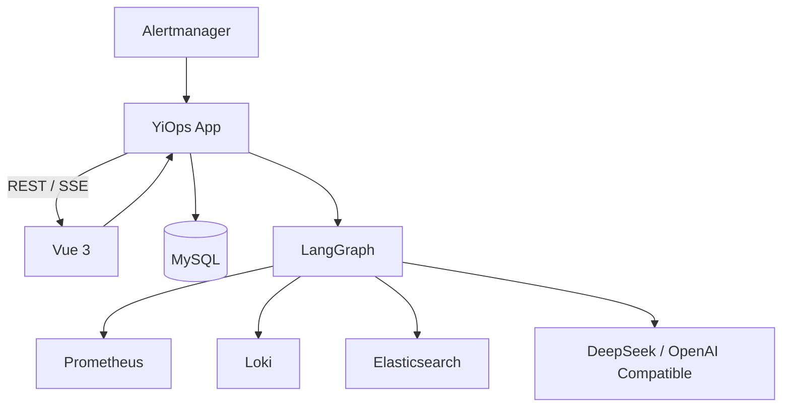
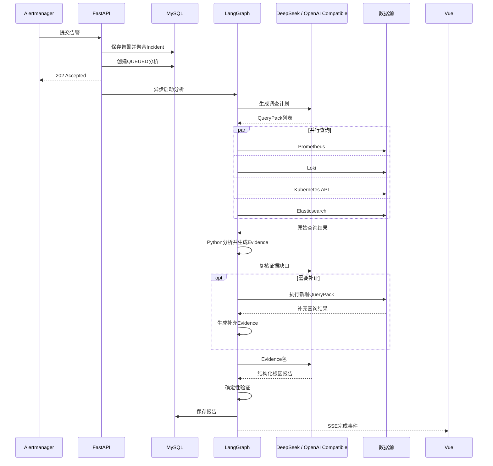

# YiOps 告警根因分析 Agent MVP 技术落地方案

## 1. 方案结论

YiOps MVP 采用一套精简的证据驱动 Agent：

```text
Vue 3
  + FastAPI 单服务
  + LangGraph 八节点固定流程
  + DeepSeek / OpenAI Compatible 多模型渠道
  + MySQL
  + Prometheus / Loki / Elasticsearch
```

一次正常分析调用模型三次：

1. 生成受控调查计划；
2. 进行一次证据缺口复核；
3. 根据证据生成结构化根因报告。

报告引用校验失败时，允许同一模型额外修正一次。

MVP 不使用：

- Redis、Celery和独立Worker；
- 多Agent；
- 无限ReAct；
- 独立Critic模型调用；
- 无限自动补证循环；
- 长期记忆和历史事故RAG；
- 向量数据库；
- MCP；
- 自动修复；
- 社区MySQL LangGraph Checkpointer。

保留的关键能力：

- 数据源并行采集；
- 单次受控补证；
- 预定义查询模板；
- Python证据压缩；
- 结构化模型输出；
- 证据ID引用；
- 确定性报告验证；
- MySQL运行状态恢复；
- SSE进度展示。

## 2. 建设目标

系统接收Alertmanager告警，通过只读工具查询Prometheus、Loki和Elasticsearch，
自动形成一份有证据支撑的根因分析报告。

需要回答：

1. 发生了什么；
2. 异常从什么时候开始；
3. 哪些实例或依赖受到影响；
4. 最可能的根因是什么；
5. 哪些证据支持或反对该结论；
6. 还缺少什么证据。

核心原则：

- DeepSeek不直接访问数据源；
- 模型不能生成任意PromQL、LogQL或ES DSL；
- 数值计算和日志统计由Python完成；
- 每项结论必须引用真实Evidence ID；
- 证据不足时明确返回`INSUFFICIENT_EVIDENCE`；
- MVP严格只读。

## 3. MVP范围

包含：

- Alertmanager Webhook；
- 手动创建Incident；
- 告警标准化、去重和聚合；
- Prometheus、Loki、Elasticsearch只读连接器；
- 单服务告警分析；
- 固定Agent工作流；
- 指标异常和日志模式提取；
- DeepSeek结构化根因报告；
- Vue Incident列表、调查详情和数据源配置；
- 工具调用审计；
- Docker Compose部署。

暂不包含：

- CMDB和发布变更；
- 自动服务拓扑推断；
- 历史事故知识库；
- 多租户复杂权限；
- 自动处置。

## 4. 精简架构



只部署三个容器：

```text
web      Vue静态资源和Nginx
app      FastAPI、Agent执行和SSE
mysql    业务数据和运行状态
```

Prometheus、Loki和Elasticsearch使用现有环境。

## 5. Agent执行过程

本节给出架构摘要，当前代码的完整触发条件、节点输入输出、置信度校准、失败恢复和
Incident 关闭逻辑见 [Agent 分析流程](./docs/agent-analysis-flow.md)。

### 5.1 八个节点


| 节点 | 执行者 | 作用 | 模型调用 |
|---|---|---|---|
| 告警标准化 | Python | 识别服务、实例、时间窗和告警类型 | 否 |
| 调查规划 | 模型 | 从有限查询包中选择需要调查的方向 | 第1次 |
| 并行采集 | Python | 并行查询 Prometheus、Loki、Kubernetes 和 Elasticsearch | 否 |
| 证据压缩 | Python | 异常计算、日志聚类、脱敏和Evidence生成 | 否 |
| 证据缺口复核 | 模型 | 按需选择尚未使用的 QueryPack 补证一次 | 第2次 |
| 根因分析 | 模型 | 生成候选根因、证据引用和建议 | 第3次 |
| 报告验证 | Python | 验证证据ID、时间顺序和输出Schema | 否 |
| 保存与展示 | Python | 写入MySQL并通过SSE通知Vue | 否 |

### 5.2 完整时序



### 5.3 告警标准化

统一格式：

```json
{
  "alert_name": "HighErrorRate",
  "service": "order-api",
  "cluster": "prod-cn",
  "namespace": "order",
  "instance": "10.0.1.12:8080",
  "severity": "critical",
  "started_at": "2026-07-26T10:00:00Z"
}
```

默认时间窗：

- 开始：告警开始时间前60分钟；
- 结束：至少覆盖告警开始后30分钟；
- 上限：不超过告警开始后6小时。

### 5.4 调查规划

第一次模型调用只允许选择查询包：

```text
service_health       请求量、错误率、P95/P99
runtime_resource     CPU、内存、GC
instance_health      Pod重启、实例数和健康状态
dependency_health    下游错误率和延迟
database_symptom     连接池、数据库超时日志
application_errors   ERROR/WARN和异常堆栈
kubernetes_cluster   Pod、工作负载、节点、Event、重启和错误日志
```

模型输出：

```json
{
  "query_packs": [
    "service_health",
    "runtime_resource",
    "application_errors"
  ]
}
```

Python将查询包映射为预定义模板。模型不选择数据源地址，也不编写查询语句。

### 5.5 并行采集

程序根据查询包并行执行 Prometheus、Loki、Kubernetes API 和 Elasticsearch：

```python
await asyncio.gather(
    collect_prometheus(...),
    collect_loki(...),
    collect_elasticsearch(...),
)
```

每个查询统一限制：

- 最大时间范围；
- 最大返回条数；
- 超时和重试；
- 索引、服务和标签白名单；
- 敏感信息脱敏；
- 查询审计。

### 5.6 证据压缩

指标由Python计算：

- 基线和故障窗口平均值；
- 峰值和变化率；
- 突变时间；
- 异常持续时间；
- 实例分布。

日志由Python完成：

- ERROR/WARN数量变化；
- 错误模板归一化；
- 堆栈指纹去重；
- 高频错误Top N；
- 新错误首次出现时间；
- Pod、实例和trace ID关联；
- 敏感字段脱敏。

产生统一Evidence：

```json
{
  "id": "metric-12",
  "type": "metric_anomaly",
  "source": "prometheus",
  "summary": "数据库活跃连接从18升至50，达到连接池上限",
  "observed_at": "2026-07-26T09:58:10Z",
  "service": "order-api",
  "quality": 0.95
}
```

原始大批量日志和完整时序不写入MySQL，也不发送给模型。

### 5.7 根因分析

第二次模型调用使用：

```text
Incident摘要
+ 查询覆盖率
+ 指标Evidence
+ 日志Evidence
+ 输出Schema
```

输出：

```json
{
  "summary": "订单接口错误率升高最可能由数据库连接池耗尽导致",
  "confidence": 0.82,
  "hypotheses": [
    {
      "cause": "数据库连接池耗尽",
      "supporting_evidence_ids": ["metric-12", "log-8"],
      "contradicting_evidence_ids": [],
      "missing_evidence": ["数据库慢查询明细"]
    }
  ],
  "recommended_actions": [
    "检查数据库慢查询",
    "核对连接池上限和等待线程"
  ]
}
```

### 5.8 报告验证

Python只做必要的确定性验证：

- JSON和Pydantic Schema；
- Evidence ID是否存在；
- Evidence是否属于当前Incident；
- 原因是否早于结果性异常；
- 是否存在未引用的重要反证；
- 推荐操作是否越过只读边界。

验证失败时，将明确的字段错误交给同一个模型修复一次。第二次仍失败则结束运行并记录错误。

MVP不增加独立Critic调用。是否需要Critic由真实故障评测结果决定。

## 6. 模型方案

Web 界面支持配置多个 OpenAI Compatible 模型渠道，同时保留历史 DeepSeek
provider 配置。一次运行使用创建任务时选中的当前渠道；未配置外部模型时回退到
本地规则模式。

三次正常调用使用不同任务提示：

| 调用 | 模式 | 原因 |
|---|---|---|
| 调查规划 | thinking disabled | 任务简单，降低延迟 |
| 证据缺口复核 | thinking disabled | 只判断是否需要新增 QueryPack |
| 根因分析 | thinking enabled / high | 需要复杂证据关联 |

统一使用JSON Output和Pydantic校验。不保存或展示模型内部推理过程。

## 7. 上下文与记忆

MVP不建设长期记忆系统。一次分析只保存：

```text
Incident
InvestigationPlan
Evidence列表
RootCauseReport
```

上下文压缩策略：

```text
原始数据
  → Python统计/聚类
  → Evidence
  → Top K去重
  → 模型上下文
```

规则：

- 单次模型输入建议限制在32K Token；
- Evidence按类型、异常强度和质量排序；
- 指标、日志和反证分别设置数量上限；
- 相同`content_hash`去重；
- 摘要必须保留Evidence ID；
- 不传递完整历史模型消息；
- 不保存思维链。

MySQL是事实存储，不是向量记忆库。同一Incident重新分析时，可以读取之前的报告和Evidence，
但默认不自动注入模型，避免旧结论影响新分析。

DeepSeek上下文缓存只用于降低重复系统提示词的成本和延迟，不作为记忆使用。

## 8. 工具调用准确率

MVP不让模型直接调用大量底层工具，而是采用：

```text
模型选择QueryPack
  → Python映射查询模板
  → Pydantic参数校验
  → Policy Guard
  → 执行查询
```

提高准确率的措施：

1. 只向模型提供6个语义清晰的QueryPack；
2. 使用枚举，不允许猜测模板ID；
3. 查询参数由程序根据Incident生成；
4. 模型不能提交PromQL、LogQL或DSL；
5. 所有执行前经过白名单、时间范围和预算校验；
6. 所有执行后检查空结果、截断、时间范围和脱敏状态；
7. 提示词包含正确选择和容易混淆的反例；
8. 建立QueryPack选择评测集。

目标：

- QueryPack选择准确率不低于95%；
- 查询参数本地校验通过率100%；
- 越权或任意查询执行数为0；
- 所有查询都有`tool_execution_id`。

## 9. MVP采用的Agent技术

只保留八项真正需要的技术：

| 技术 | 作用 | YiOps中的应用 |
|---|---|---|
| Stateful Workflow | 显式控制执行顺序和状态 | LangGraph八节点流程 |
| Plan-and-Execute | 分离调查决策与工具执行 | 模型选QueryPack，Python执行 |
| Structured Output | 将模型结果变成可校验对象 | JSON Output和Pydantic |
| Controlled Tools | 限制模型的数据访问能力 | QueryPack、模板和Policy Guard |
| Fan-out/Fan-in | 降低多数据源采集耗时 | 四类数据源并行查询 |
| Evidence Grounding | 防止无证据结论 | 报告强制引用Evidence ID |
| Context Engineering | 控制模型输入质量和长度 | Top K Evidence和32K预算 |
| Agent Observability | 支持调试、审计和评测 | 节点、查询、Token和引用记录 |

不为了“前沿”堆叠技术。Reflection、长期记忆、RAG、多Agent和MCP都需要由后续评测或
实际复用需求驱动。

## 10. 应用内任务执行与恢复

API和Agent运行在同一个Python进程中，但逻辑模块分开。

任务流程：

1. API向MySQL写入`QUEUED`分析；
2. 应用内`AnalysisSupervisor`将任务加入`asyncio.Queue`；
3. Supervisor使用Semaphore限制并发；
4. 每个节点开始和完成时更新`analysis_runs.current_step`；
5. 节点结果及时写入MySQL；
6. 应用重启时扫描`QUEUED/RUNNING`任务并重新执行；
7. 已完成的幂等节点读取已有结果并跳过外部查询。

MVP是单实例、单Uvicorn进程，因此不需要任务租约和`SKIP LOCKED`。未来部署多个实例时
再引入Redis和独立Worker。

SSE使用应用内事件队列。连接中断后，前端通过REST读取MySQL中的当前状态。

## 11. Vue前端

MVP只做三个页面。

### Incident列表

- 时间、服务、严重级别和状态筛选；
- 显示告警数、开始时间和分析状态；
- 显示最可能根因和置信度。

### Incident调查详情

展示：

- 告警信息；
- Agent八节点进度；
- 指标异常；
- 日志模式；
- 根因假设；
- 支持和反对证据；
- 缺失证据；
- 工具调用记录；
- 推荐操作。

点击Evidence ID时打开证据详情。

### 数据源配置

- Prometheus、Loki、Elasticsearch地址；
- 凭据配置状态；
- 连通性测试；
- 启用和停用。

前端技术：

```text
Vue 3 + TypeScript + Vite
Element Plus
Vue Router
Pinia
Vue Query
Axios
ECharts
```

## 12. MySQL核心表

MVP保留八张业务表：

| 表 | 作用 |
|---|---|
| `datasource_configs` | 数据源和密钥引用 |
| `alert_events` | 标准化告警 |
| `incidents` | 聚合后的故障 |
| `analysis_runs` | 运行状态和当前节点 |
| `tool_executions` | 查询审计 |
| `evidence_items` | 标准化证据 |
| `root_cause_reports` | 根因报告 |
| `user_feedback` | 人工确认结果 |

原始日志和完整指标序列不进入MySQL。

## 13. 项目结构

```text
YiOps/
├── backend/
│   ├── app/
│   │   ├── api/
│   │   ├── agents/
│   │   │   ├── graph.py
│   │   │   ├── state.py
│   │   │   └── nodes/
│   │   ├── analysis/
│   │   ├── connectors/
│   │   ├── tools/
│   │   ├── models/
│   │   ├── schemas/
│   │   ├── runtime/
│   │   │   └── supervisor.py
│   │   └── main.py
│   ├── migrations/
│   ├── tests/
│   └── pyproject.toml
├── frontend/
│   ├── src/
│   ├── tests/
│   └── package.json
├── docker-compose.yml
├── .env.example
└── README.md
```

## 14. 实施顺序

### 第一阶段：基础工程

- FastAPI、Vue、MySQL和Docker Compose；
- Alertmanager Webhook；
- Incident聚合；
- Incident列表和详情。

### 第二阶段：数据与证据

- 三个连接器；
- QueryPack和查询模板；
- 指标计算和日志压缩；
- Evidence和工具审计。

### 第三阶段：Agent

- LangGraph八节点流程；
- 模型规划、单次补证复核和根因分析；
- 结构化报告和确定性验证；
- 应用内任务执行和恢复；
- SSE进度。

### 第四阶段：验证

- 历史故障样本；
- QueryPack选择评测；
- 根因和证据评测；
- 端到端测试；
- Docker Compose验收。

## 15. MVP验收标准

1. Alertmanager告警能够创建或合并Incident；
2. 单服务Incident可以完成一次端到端分析；
3. 一次正常分析调用模型三次，报告校验失败时最多额外修正一次；
4. 四类数据源只能通过预定义模板查询；
5. 原始大批量日志不会发送给模型；
6. 每个根因结论可以定位到真实Evidence；
7. 不存在的Evidence引用不能进入报告；
8. 证据不足时明确返回`INSUFFICIENT_EVIDENCE`；
9. 应用重启后可以恢复未完成分析；
10. Vue可以展示进度、证据和报告；
11. 数据源凭据不会进入浏览器或模型；
12. Docker Compose可以一键启动。

## 16. 后续演进条件

只有满足明确条件时才增加复杂能力：

| 能力 | 引入条件 |
|---|---|
| Redis和独立Worker | 需要多实例或更高分析并发 |
| Critic | 历史评测显示过度因果或错误结论较多 |
| 多轮自动补证循环 | 单次受控补证的证据覆盖率仍不足 |
| Kubernetes/发布事件 | 日志指标无法解释主要故障 |
| 历史事故RAG | 已积累足够人工确认的故障案例 |
| MCP | 工具需要被多个Agent或系统复用 |
| 多Agent | 单图无法处理明确可分解的复杂跨域故障 |
| 自动处置 | 只读分析稳定且具备人工审批机制 |

## 17. 官方参考

- [Prometheus HTTP API](https://prometheus.io/docs/prometheus/3.5/querying/api/)
- [Loki HTTP API](https://grafana.com/docs/loki/latest/reference/loki-http-api/)
- [Elasticsearch Python Client](https://www.elastic.co/docs/reference/elasticsearch/clients/python)
- [LangGraph](https://docs.langchain.com/oss/python/langgraph/overview)
- [LangGraph Workflows and Agents](https://docs.langchain.com/oss/python/langgraph/workflows-agents)
- [DeepSeek Tool Calls](https://api-docs.deepseek.com/guides/tool_calls)
- [DeepSeek Thinking Mode](https://api-docs.deepseek.com/guides/thinking_mode)
- [DeepSeek JSON Output](https://api-docs.deepseek.com/guides/json_mode)
- [DeepSeek Context Caching](https://api-docs.deepseek.com/guides/kv_cache)
- [Vue](https://vuejs.org/)
- [Element Plus](https://element-plus.org/)
