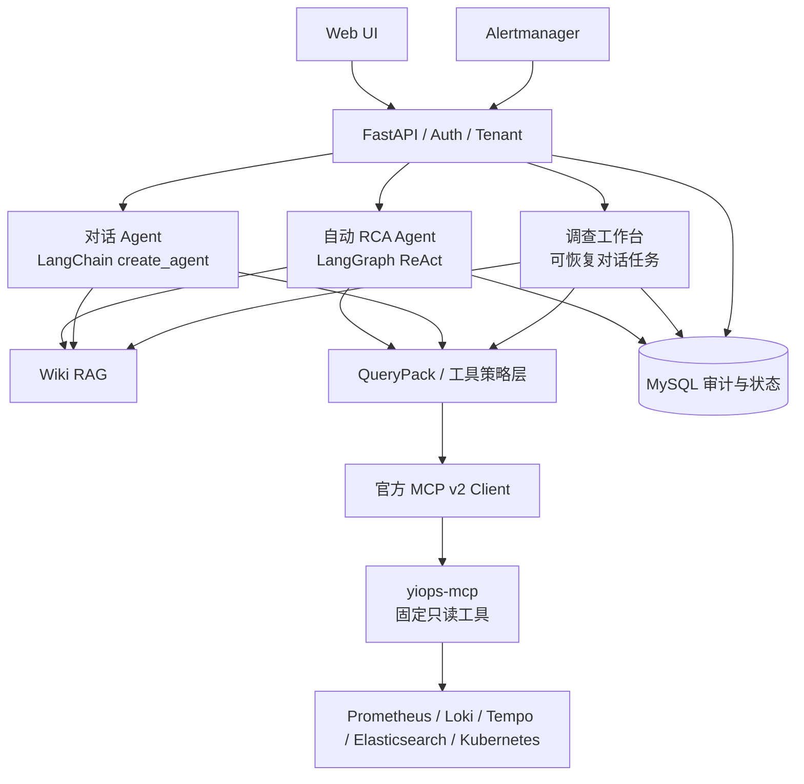
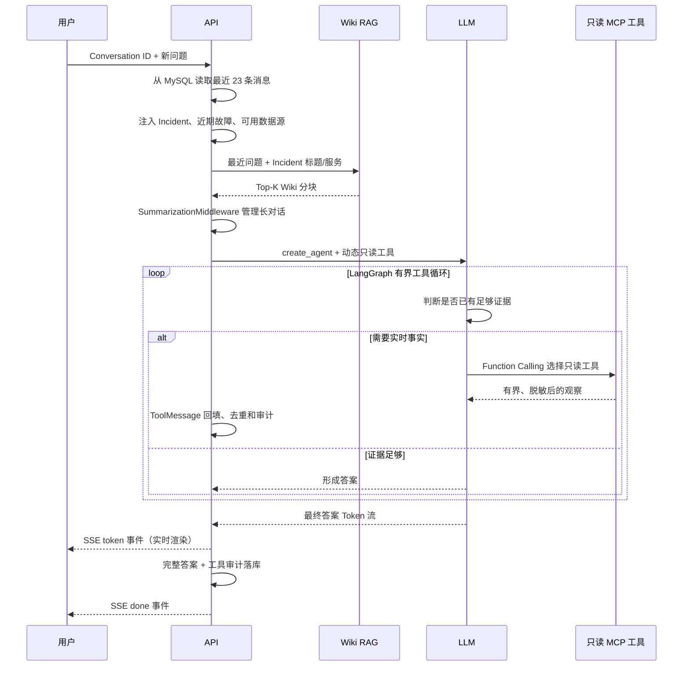
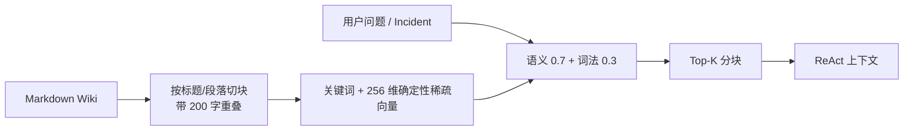

# YiOps Agent 技术架构、流程与原理

本文档对应 YiOps `0.2.x`（更新于 2026-08-09），说明自动 RCA Agent、对话 Agent、Wiki RAG、
只读 MCP 数据层的实际架构与执行流程，以及各层的安全边界。

核心实现：

- `backend/app/services/incidents.py`：告警去重、聚合和恢复；
- `backend/app/api/control_plane.py`：数据源、模型渠道、故障与集成的控制面 API；
- `backend/app/runtime/rca_supervisor.py`：自动 RCA 队列、并发控制和启动恢复；
- `backend/app/agents/conversation.py`：LangChain `create_agent`、Middleware 和原生流式输出；
- `backend/app/agents/tools.py`：Pydantic 工具参数、动态工具集和只读数据源执行；
- `backend/app/agents/rca.py`：LangGraph 有界 ReAct 自动 RCA 流程；
- `backend/app/agents/query_catalog.py`：自动 RCA 的受控 QueryPack 和查询模板；
- `backend/app/mcp/server.py`：统一 Streamable HTTP MCP Server、固定只读工具和租户认证；
- `backend/app/mcp/client.py`：API 侧官方 MCP v2 Client 与 Agent Tool 适配；
- `backend/app/connectors/datasources.py`：服务端原生只读连接器和结果归一化；
- `backend/app/memory/`：上下文预算、Wiki 切块和混合检索；
- `backend/app/analysis/evidence.py`：证据压缩、脱敏和评分；
- `backend/app/llm/gateway.py`：OpenAI-compatible 模型渠道与 LangChain 结构化输出；
- `backend/app/analysis/local_report.py`：未配置模型时的确定性本地报告规则。

## 架构原则：框架优先，领域代码最小化

YiOps 的默认决策是：**主流框架已经稳定解决的问题，不自行重写**。选择依赖时优先考虑活跃维护、协议
兼容、安全记录、社区规模、许可证、可测试性和长期升级成本；不因为几行代码看起来简单，就复制协议、
生命周期、序列化、重试、认证或数据库迁移能力。

| 能力 | 当前采用的主流实现 | YiOps 只保留的代码 |
|---|---|---|
| MCP 协议 | 官方 MCP Python SDK v2 `MCPServer` / `Client` | 固定工具定义、内部租户桥接、结果适配 |
| Agent 与工作流 | LangChain `create_agent`、LangGraph | QueryPack、停止条件、证据约束和报告校验 |
| Web / ASGI | FastAPI、Starlette、Uvicorn | 控制面 API、Workspace 权限和业务中间件 |
| Schema / 配置 | Pydantic、pydantic-settings | YiOps 领域模型和参数边界 |
| 数据库 / 迁移 | Tortoise ORM、Aerich、MySQL | Incident、Evidence、审计等领域表结构 |
| HTTP 客户端 | HTTPX / MCP SDK 使用的 HTTPX2 | 各数据源的少量只读 API 映射 |
| 凭据加密 | `cryptography` Fernet | 密钥装载和加密字段封装 |
| 前端 | Vue、Vue Router、Element Plus | 运维工作流和证据展示 |

允许自研的范围仅限 YiOps 的差异化领域逻辑，或成熟框架没有提供的薄适配层。新增自研基础设施前，必须
在设计或 PR 中说明：现有框架为何不能满足、最小自研边界是什么、如何测试，以及未来如何替换。不得
自行实现 MCP/HTTP 协议栈、ORM、通用任务队列、通用认证框架、模板引擎或前端组件库。

## 0. 系统全景

YiOps 有两条 Agent 路径，共用同一套数据源、记忆和安全边界：

- **自动 RCA Agent**：由告警触发，使用 LangGraph 持久化运行状态，最终产生可验证的根因报告；
- **对话 Agent / 调查工作台**：由用户问题触发，使用有界 ReAct 工具循环，按需查询实时数据并回答。



LLM 不持有数据源地址或凭据，也不能生成任意命令。它只能从当前请求暴露的函数工具或 QueryPack 中
选择；Python 再执行参数校验、权限判断、结果压缩和审计。

## 1. Agent 原理

YiOps Agent 本质上是一个**会根据现场情况选择调查动作的程序流程**，不是让大模型直接连接生产环境
自由操作。

它会读取告警、选择调查方向、调用只读工具、查看查询结果、补充一次证据，最后形成根因假设。整个过程
由四部分协作：

| 组件 | 负责什么 |
|---|---|
| LLM | 选择调查方向、检查证据缺口、关联证据并生成根因假设 |
| Python | 通过只读 MCP 查询真实数据、压缩证据、校验引用、限制权限和置信度 |
| LangGraph | 按顺序执行节点，在节点之间传递状态 |
| MySQL | 保存任务、工具调用、Evidence 和报告，支持审计与恢复 |

核心原则：

1. **先取证，再分析**：告警只是线索，根因结论必须回到实际查询结果；
2. **模型做判断，程序守边界**：LLM 处理模糊推理，Python 处理查询、计算和验证；
3. **有限自主**：模型只能选择白名单 QueryPack，不能指定任意 MCP 工具或执行修复；
4. **多源验证**：关联指标、日志、Tempo 链路、Kubernetes 状态和 Elasticsearch 事件；
5. **允许不知道**：证据不足时返回 `insufficient_evidence`，不强行生成根因；
6. **过程可追溯**：每次查询、证据和报告引用都持久化。

## 2. 一次分析如何运行


### 2.1 告警进入系统

Alertmanager 可能重复发送相同告警，也可能同时发送同一故障引起的多条告警。后端先完成：

1. 合并公共标签和单条告警标签；
2. 使用 fingerprint 和开始时间去重；
3. 按服务、集群、namespace、告警名称和 10 分钟时间桶生成聚合键；
4. 将相关活动告警归入同一个 `Incident`。

服务名按以下顺序识别：

```text
service label → app label → job label → unknown-service
```

满足以下条件时自动创建 `AnalysisRun`：告警为 `firing`、Incident 为 `open`、渠道开启自动分析，并且
该 Incident 还没有分析任务。也可以手动创建任务；已有 `queued` 或 `running` 任务时不会重复执行。

### 2.2 后台启动分析

`RcaSupervisor` 将任务放入 `asyncio.Queue`，固定数量的 Worker 负责执行。队列控制并发，数据库
保存任务进度，因此页面关闭不会中断分析，应用重启后未完成任务也能重新入队。

### 2.3 有界 ReAct Agent

```text
normalize + retrieve memory → react ⇄ act/observe → analyze → validate → save
```

| 节点 | 执行者 | 实际动作 | 产物 |
|---|---|---|---|
| `normalize` | Python + RAG | 整理 Incident，并检索相关 Wiki 分块 | Incident 与长期记忆 |
| `react` | LLM | 根据已有观察选择一个 QueryPack，或决定停止 | 可审计的决策摘要 |
| `act/observe` | Python + MCP | 执行固定模板，压缩、脱敏并写入 Evidence | ToolExecution 与观察 |
| `analyze` | LLM | 基于 Evidence 生成根因假设、反证和建议 | 结构化报告 |
| `validate` | Python / LLM | 校验证据引用并限制置信度，引用错误时修正一次 | 已验证报告 |
| `save` | Python | 保存报告和状态，通过 SSE 通知前端 | RootCauseReport |

每轮 `react` 只允许选择代码登记的 QueryPack，最多 6 轮且不能重复；达到停止条件后进入综合。只有证据
引用验证失败时才额外修正一次。本地规则模式使用同样的循环边界，但不调用外部模型。

### 2.4 一个完整例子

假设收到 `payments-api` 的 `KubePodCrashLooping` 告警：

1. 系统将重复告警聚合成一个 Incident，并创建后台任务；
2. 系统检索到相关启动故障手册，模型首轮选择 `kubernetes_cluster`；
3. 观察到 Pod 为 `CrashLoopBackOff` 后，模型下一轮选择 `application_errors`，Loki 中出现
   `DATABASE_URL is missing`，健康实例数
   从 3 降到 0；
4. 程序将三项结果压缩成 `k8s_01`、`log_02` 和 `metric_03` 三条 Evidence；
5. 模型判断当前证据足够，不再补查；
6. 模型生成“数据库连接配置缺失导致应用启动失败”的根因假设，并引用上述 Evidence；
7. Python 确认证据 ID 真实存在，下调过高置信度，并保存报告；
8. 报告同时指出还未直接检查 Deployment、ConfigMap 或 Secret，因此这仍是有证据支持的假设，而不是
   无条件确认的事实。

整个数据变化过程是：

```text
AlertEvent
→ Incident
→ InvestigationPlan
→ ToolExecution
→ Evidence
→ RootCauseReport
```

### 2.5 对话 Agent 如何运行

对话 Agent 与自动 RCA Agent 都运行在 LangGraph 体系内：自动 RCA 使用显式 `StateGraph` 表达确定性的
取证和验证流程；对话 Agent 使用 LangChain `create_agent` 生成标准 LangGraph 工具循环。Function
Calling、ToolMessage 回填、重试、调用上限、上下文摘要和流式事件均由框架处理。



当前对话循环的关键策略：

1. **动态工具集**：只向模型暴露当前 Workspace 已启用数据源对应的工具，避免模型调用不存在的 Tempo、
   Elasticsearch 等数据源；
2. **范围继承**：在 Incident 页面提问时，Kubernetes 查询默认继承该故障的 cluster 和 namespace；
3. **框架工具循环**：`create_agent` 根据模型 `tool_calls` 自动执行 LangChain Tool、添加 ToolMessage 并
   继续推理，直到模型形成答案；
4. **查询去重**：同一工具与同一参数只执行一次，后续重复调用复用观察结果；
5. **Middleware 预算**：`ToolCallLimitMiddleware` 默认限制每次对话最多 8 个工具调用，
   `ModelCallLimitMiddleware` 限制模型循环；
6. **框架重试与失败隔离**：`ToolRetryMiddleware` 处理瞬时工具失败，最终失败作为观察返回，模型仍可
   基于其他来源回答，但必须明确证据缺口；
7. **输出净化**：不向用户展示 ReAct 状态、查询计数和思维过程，复杂回答直接从业务结论开始；
8. **服务端多会话**：会话和消息按 Tenant/Incident 落库，可创建、切换、重命名和级联删除；旧版浏览器
   `localStorage` 对话首次打开时自动导入；
9. **框架原生流式输出**：`POST /api/v1/chat/conversations/{id}/messages/stream` 消费 LangGraph
   `astream(stream_mode=["messages", "values"])`，将模型消息增量转换成 SSE `token`，并以 `done` 返回
   最终状态和工具审计；
10. **长上下文摘要**：接近上下文预算 70% 时由 `SummarizationMiddleware` 归纳较早消息并保留最近 12
    条，完整消息仍保存在 MySQL；
11. **简单问题直答**：无需实时事实的问题不强制调用工具，也不套用 RCA 长模板。

相关参数：

```dotenv
YIOPS_AGENT_MAX_CONTEXT_TOKENS=24000
YIOPS_AGENT_MAX_REACT_ROUNDS=6
YIOPS_CHAT_MAX_TOOL_CALLS=8
YIOPS_CHAT_TOOL_RESULT_CHARS=8000
```

## 3. 查询、证据和报告

### 3.1 受控查询

模型只能选择以下 QueryPack：

| QueryPack | 调查内容 |
|---|---|
| `kubernetes_cluster` | Pod、工作负载、节点、Event、重启和错误日志 |
| `service_health` | 请求量、错误率和 P99 延迟 |
| `runtime_resource` | 进程 CPU 和内存 |
| `instance_health` | 健康实例数 |
| `dependency_health` | 下游错误率和延迟 |
| `database_symptom` | 连接池和数据库超时日志 |
| `application_errors` | Loki、Tempo 和 Elasticsearch 应用错误 |

Python 将 QueryPack 映射为 `agents/query_catalog.py` 中的固定模板，并自动填入服务、集群、namespace
和时间范围；
`MCPDatasourceGateway` 再将模板映射到统一服务端的固定 MCP 工具。模型和数据源配置都不能覆盖工具
名称或原生 API 路径。
默认查询告警前 60 分钟到告警后至少 30 分钟，最长不超过告警开始后 6 小时。

所有查询并发执行并记录参数、状态、耗时、结果数量和错误码。`collection_summary` 明确区分“查询成功但
没有结果”和“数据源不可用”，避免模型把没查到数据误判为系统正常。

### 3.2 Evidence

只有成功且非空的查询结果才生成 Evidence：

- 指标：计算前后平均值、峰值和变化率；
- 日志：限制样本数量和长度，提取错误模式；
- Kubernetes：保留异常对象、容器状态、重启数和 Warning Event；
- Tempo：保留 trace ID、根服务、根操作、耗时及受限数量的 span；
- 敏感内容：对 authorization、token、password、secret 和 Bearer Token 脱敏；
- 重复内容：使用 `content_hash` 去重。

Evidence 统一带有 ID、类型、来源、摘要、观测时间、质量分和工具执行 ID。程序按质量、异常程度和与
告警时间的距离排序，默认最多向模型提供 30 条；完整原始日志不会直接发送给模型。

### 3.3 报告与验证

模型输出包括：

```json
{
  "summary": "应用因数据库连接配置缺失而持续启动失败",
  "confidence": 0.85,
  "hypotheses": [
    {
      "cause": "DATABASE_URL 未配置",
      "confidence": 0.85,
      "supporting_evidence_ids": ["log_02", "k8s_01"],
      "contradicting_evidence_ids": [],
      "missing_evidence": ["实际环境变量配置"]
    }
  ],
  "recommended_actions": ["检查 Deployment、ConfigMap 和 Secret"],
  "missing_evidence": ["数据库连通性检查"]
}
```

Python 验证输出 Schema、Evidence ID 和支持证据。置信度不能完全由模型自行决定：

- 无 Evidence：总体上限 0.20；
- 有 Evidence：基础上限 0.65；
- 证据更多、覆盖多个数据源时逐步提高；
- 单个假设只有一条支持证据时，该假设不超过 0.72；
- 总体最高不超过 0.93；
- 缺少跨数据源验证时，报告自动标记证据缺口。

### 3.4 统一只读 MCP 数据层

所有实时查询都经过项目内置的 `yiops-mcp`。Agent 仍只看到稳定的 LangChain Tool；API 侧适配器使用
官方 MCP Python SDK v2，通过 Streamable HTTP 调用固定的七个工具（六个查询工具和一个控制面连接
探测工具）。服务端工具全部声明 `readOnlyHint=true`、`destructiveHint=false`。

| MCP 工具 | 原生接口 | 使用方 |
|---|---|---|
| `query_prometheus` | Prometheus `/api/v1/query_range` | 自动 RCA、调查工作台、AI 助手 |
| `query_loki_logs` | Loki `/loki/api/v1/query_range` | 自动 RCA、调查工作台、AI 助手 |
| `search_tempo_traces` | Tempo `/api/search` | 自动 RCA、调查工作台、AI 助手 |
| `get_tempo_trace` | Tempo `/api/v2/traces/{id}` | 调查工作台、AI 助手 |
| `query_elasticsearch_logs` | Elasticsearch `/{index}/_search` | 自动 RCA、调查工作台、AI 助手 |
| `inspect_kubernetes` | Kubernetes Pod、Workload、Node、Event GET API | 自动 RCA、调查工作台、AI 助手 |
| `probe_datasource` | 对应数据源健康接口 | 仅控制面连接测试，不暴露给模型 |

```text
Agent Tool → MCPDatasourceGateway → official MCP Client → yiops-mcp
           → native read-only connector → datasource API
```

服务端只实现固定查询，不提供任意 URL、HTTP method 或 Kubernetes 资源路径工具：Prometheus 和 Loki
使用区间查询 API，Tempo 使用 TraceQL 搜索与 trace-by-id，Elasticsearch 只调用 `_search`，Kubernetes
只 GET Pod、Workload、Node 和 Warning Event。查询参数、数量、时间窗、返回大小与脱敏均在代码中限制。

原生连接器不是自建 HTTP 框架：连接池、超时、TLS、认证和异常模型由 HTTPX 提供，YiOps 只映射少量
官方只读 Endpoint 与领域结果。为每个数据源再部署一个 MCP Server，或为简单 REST 查询引入维护质量
不确定的专用 SDK，都会增加进程、配置与供应链成本。若某数据源未来提供成熟官方 SDK，且它能实质改善
认证、分页、兼容或重试，连接器应优先迁移到该 SDK，而不是继续扩展自定义协议代码。

API 和 MCP 使用内部 Bearer Token 认证；租户 ID 由认证后的 API 通过 `X-YiOps-Tenant-ID` 注入，不能由
LLM 或工具参数选择。MCP 与 API 共享数据库和凭据密钥卷，数据源凭据由 Fernet 加密保存，仅 MCP 进程
解密使用。Compose 不向宿主机发布 MCP 端口。

数据源认证由控制面保存为 `none`、`bearer`、`basic` 或 `api_key`。非敏感连接设置保存在
`DatasourceConfig.settings`，Token、密码和 API Key 保存在加密 `secret_ref`。API 对认证敏感值只返回
`secret_configured`；Basic Auth 用户名属于非敏感配置，可以返回，密码永不返回。

部署拓扑只有三个常驻服务：MySQL、`yiops-mcp`、YiOps API。`service.sh` 的 source mode 同时管理 API
和 MCP PID；Compose mode 使用共享 `runtime_data` 卷，并通过 MCP `/health` 后才启动 API。扩容到多实例
前应把凭据密钥迁移到外部 Secret/KMS，并保证所有 MCP 实例读取同一密钥材料。API 的
`/api/v1/health/ready` 会同时检查 MySQL 和 MCP；任一依赖不可用都会返回 503。

## 4. 当前使用的 Agent 技术

| 技术 | 在 YiOps 中的用法 |
|---|---|
| Stateful Workflow | LangGraph 编排节点并传递 `AgentState` |
| Conversation Agent | LangChain `create_agent` 生成标准 LangGraph Function Calling 循环 |
| ReAct | 模型在每轮观察后选择一个 QueryPack 或停止，程序限制轮次和重复调用 |
| Tool Use | 官方 MCP v2 Client 调用内置 Streamable HTTP MCP Server，服务端执行固定原生只读查询 |
| Parallel Execution | `asyncio.gather` 并发访问多个数据源 |
| Context Engineering | `SummarizationMiddleware` + 业务上下文聚合、Top-K、脱敏和去重 |
| RAG Memory | Wiki Markdown 切块、确定性稀疏向量与关键词混合检索 |
| Evidence Grounding | 根因假设引用真实 Evidence ID |
| Reflection | 模型进行一次受限的证据缺口复核 |
| Structured Output | LangChain `with_structured_output` + Pydantic 约束模型输出 |
| Guardrails | 查询白名单、只读权限、引用校验和置信度上限 |
| Memory | `AgentState` 保存短期状态，MySQL 保存运行轨迹 |
| Observability / Eval | 记录节点、工具、Token 和证据，并运行 RCA 评测 |

当前使用的是受白名单、轮次和上下文预算约束的 ReAct，而不是开放式自主 Agent；长期记忆来自 Workspace
Wiki RAG。尚未引入多 Agent、历史事故自动沉淀、GraphRAG、因果图、在线强化学习或自动修复。

### 4.1 上下文过长如何处理

上下文预算不是简单截断最后若干字符，而是分层处理：

```text
完整数据库记录
  ├─ 当前 Incident / 用户问题（最高优先级）
  ├─ 高质量实时 Evidence / 工具观察
  ├─ Top-K Wiki 分块
  ├─ 最近对话原文
  └─ 较早对话压缩摘要（最低优先级）
          ↓
    预算内模型上下文
```

- 使用保守的 UTF-8 Token 估算，默认总预算 24000；
- 对话 Agent 为系统规则、最终输出和工具观察预留空间，初始业务上下文最多约四分之一；
- LangChain `SummarizationMiddleware` 在估算 Token 达到上下文预算 70% 时总结旧消息，并保留最近 12 条；
- 工具结果默认限制为 8000 字符，超限时保留状态、参数、数量与预览；
- 自动 RCA 优先保留质量高、时间相关、来源多样的 Evidence；
- MySQL 中的完整工具轨迹和 Evidence 不因模型上下文压缩而删除。

### 4.2 Wiki RAG 记忆原理

Wiki 是 Workspace 级长期记忆，页面支持 Markdown 草稿、发布、版本、重建索引，以及批量上传
`.md`、`.markdown`、`.txt` 文件。上传同名文件会生成新版本并重建索引；只有 `published` 文档参与检索。



当前向量是本地确定性哈希稀疏向量，不依赖外部 Embedding API；优点是部署简单、结果可复现，缺点是
语义能力弱于专用向量模型。Wiki 只能提供排障手册、架构说明和历史经验，不能证明当前环境已经发生某
事件；模型引用时必须标为 `[Wiki:标题 v版本]`，实时结论仍需 MCP 证据。

### 4.3 状态、记忆与审计的区别

| 层级 | 内容 | 生命周期 | 是否进入模型 |
|---|---|---|---|
| 短期状态 | 当前 ReAct 决策、已用 QueryPack、工具预算 | 单次运行 | 是，按预算压缩 |
| 会话历史 | `ChatConversation` 与用户/助手消息 | MySQL 服务端长期保存 | 最近原文 + 旧消息摘要 |
| Wiki 记忆 | 手册、架构、经验 | Workspace 长期 | Top-K 分块 |
| 实时证据 | 指标、日志、Trace、K8s 对象 | 每次查询/分析运行 | 有界摘要 |
| 审计记录 | ToolExecution、Evidence、报告、Token | 数据库长期 | 按需读取，不全量注入 |

## 5. 恢复与安全边界

### 5.1 任务恢复

- 应用启动时重新入队 `queued` 和 `running` 任务；
- 已保存的调查计划、工具结果和报告会被复用；
- 相同模板在同一次运行中不会重复查询；
- 只有失败任务允许调用 retry API；
- 调查任务和 AI 对话 SSE 每 15 秒发送心跳；对话流断开时取消当前生成，前端再通过会话 REST 接口恢复
  已成功落库的消息，避免把不完整答案当成最终结果。

### 5.2 Incident 恢复

Alertmanager 需要配置 `send_resolved: true`。收到恢复通知后，系统更新对应 AlertEvent；当 Incident 下
所有关联告警都恢复时，将 Incident 标记为 `resolved`。恢复通知不会创建新的分析任务。

### 5.3 安全边界

- Agent 只执行代码中登记的查询模板和 MCP 工具白名单；
- 模型不能直接访问数据源、凭据或网络；
- 连接测试由 MCP Server 直接探测原生只读 API，MCP 不提供通用 HTTP 或写工具；
- Kubernetes 连接器只执行 GET，并且必须使用只读 ServiceAccount 和最小 RBAC；
- 告警、日志和 Evidence 都按不可信数据处理；
- 日志进入模型前采样、截断和脱敏；
- Wiki 内容按不可信背景知识处理，不能作为当前故障已经发生某事件的证据；
- 上下文超限时优先保留高质量 Evidence 和近期消息，旧对话生成压缩摘要，完整记录仍保存在数据库；
- 工具调用、Evidence、Token 和报告引用均可审计；
- 当前版本不会修改 Kubernetes、数据库或其他外部系统。

## 6. 技术演进路线

目标不是简单增加模型或 Agent 数量，而是逐步建立：

```text
统一遥测与变更上下文
→ 主动验证根因假设
→ 时序拓扑与因果排名
→ 独立验证和历史经验
→ 安全的修复闭环
```

| 阶段 | 主要建设 | 目标 |
|---|---|---|
| P0：评测与数据底座 | 统一只读 MCP、实战故障注入、隐藏评测集、trajectory replay、OpenTelemetry Trace、发布和配置变更 | 去除非必要网关依赖，保证数据完整，并能客观衡量改进 |
| P1：主动调查 | Hypothesis Board、服务拓扑和时序因果排名 | 在现有 ReAct、查询预算和停止条件上继续增强假设验证 |
| P2：知识与协作 | 时态知识图谱、历史事故自动记忆、GraphRAG、独立 Verifier、按领域拆分的专家 Agent | 在现有 Wiki RAG 上处理跨服务、跨数据源和复杂传播故障 |
| P3：学习与修复 | 离线微调、偏好学习、shadow/canary、人工审批和自动回滚 | 用已确认事故优化策略，逐级开放修复能力 |

### 6.1 已完成：统一数据源 MCP，去除 Grafana 依赖

本版本已用单一 `yiops-mcp` 替换 Grafana MCP、Tempo MCP 和 Kubernetes MCP 依赖。数据源页面直接配置
原生 API 地址和最少认证字段；自动 RCA、调查工作台和对话 Agent 共用同一 MCP Client 与固定工具集。
这是一次不兼容迁移，旧 MCP Endpoint 与 Grafana datasource UID 不再读取。

后续连接器扩展遵循同一原则：先在服务端实现受限的原生只读客户端，再增加一个语义明确、参数有界的
MCP 工具；不引入按数据源拆分的常驻 MCP 服务，也不暴露通用 HTTP 代理能力。

优先级上，Trace、变更事件、评测环境和 Hypothesis Board 应早于多 Agent 与 GraphRAG。多 Agent 只能
通过共享 Evidence ID 协作，历史事故只能提供候选假设，二者都不能替代当前故障的实时证据。

自动修复必须最后开放，并经过：

```text
结构化修复计划
→ Policy 校验
→ dry-run / 沙箱验证
→ 人工审批
→ 小范围 canary
→ 观察 SLO
→ 扩大执行或自动回滚
```

相关研究与标准：

- [OpenTelemetry 规范](https://opentelemetry.io/docs/specs/otel/overview/)
- [OpenRCA](https://proceedings.iclr.cc/paper_files/paper/2025/hash/d29b8d53678015079e1d245c023e49d2-Abstract-Conference.html)
- [AIOpsLab](https://microsoft.github.io/AIOpsLab/)
- [SREGym](https://arxiv.org/abs/2605.07161)
- [微服务因果 RCA 方法评测](https://arxiv.org/abs/2408.13729)
- [GraphRAG](https://arxiv.org/abs/2404.16130)
