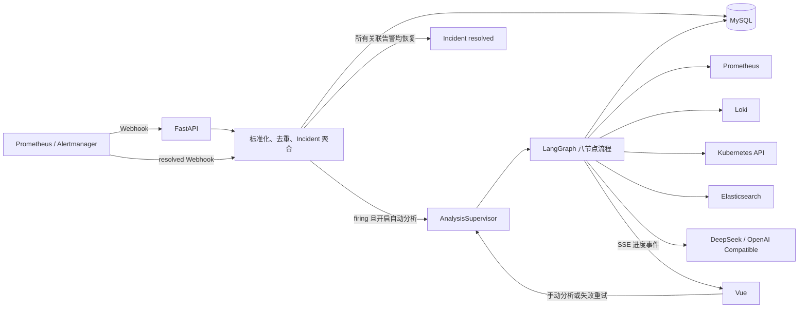
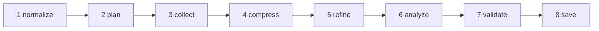

# YiOps Agent 分析流程

本文档描述当前代码实际执行的告警分析流程。核心实现位于：

- `backend/app/services/incidents.py`：告警标准化、去重、聚合和恢复；
- `backend/app/api/router.py`：分析任务创建、自动触发和查询接口；
- `backend/app/runtime/supervisor.py`：任务队列、并发控制和启动恢复；
- `backend/app/agents/graph.py`：LangGraph 八节点分析流程；
- `backend/app/tools/catalog.py`：受控 QueryPack 与查询模板；
- `backend/app/connectors/client.py`：数据源只读查询；
- `backend/app/analysis/evidence.py`：证据压缩、脱敏和质量评分；
- `backend/app/llm/deepseek.py`：OpenAI Compatible 模型调用。

## 1. 端到端链路



系统只负责调查和生成建议，不执行自动修复或变更操作。

## 2. 告警接入与分析触发

### 2.1 Alertmanager Webhook

Alertmanager 告警到达后，后端依次执行：

1. 合并 `commonLabels` 和单条告警的 `labels`；
2. 提取 `alertname`、`service`、`cluster`、`namespace`、`instance`、`severity`、
   `startsAt` 和 `endsAt`；
3. 优先使用 Alertmanager `fingerprint`，缺失时根据告警字段生成指纹；
4. 使用 `cluster + namespace + service + alertname + 10 分钟时间桶` 生成聚合键；
5. 同一指纹和开始时间的通知作为同一条 `AlertEvent` 更新；
6. 相同聚合键的活动告警归入同一个 `Incident`。

服务名按以下优先级识别：

```text
service label → app label → job label → unknown-service
```

### 2.2 自动分析

告警接入渠道默认开启 `auto_analyze`。满足以下条件时自动创建
`AnalysisRun`：

- 告警状态是 `firing`；
- Incident 状态是 `open`；
- 该 Incident 尚未创建过分析运行；
- 接入渠道已启用自动分析。

`resolved` 或 `closed` 通知不会创建分析任务。关闭自动分析后，可以在 Incident
页面或通过 `POST /api/v1/incidents/{incident_id}/analysis-runs` 手动启动。

同一 Incident 已有 `queued` 或 `running` 任务时，手动请求会返回现有任务，不会
重复执行。

### 2.3 模型渠道选择

创建分析任务时会记录当前模型名称；实际执行时按以下顺序加载运行时：

1. 数据库中当前启用、已配置密钥的模型渠道；
2. `.env` 中的兼容 DeepSeek 配置；
3. 本地规则模式 `local-evidence-rules`。

数据库模型渠道统一使用 OpenAI Compatible Chat Completions 协议；历史
`deepseek` provider 配置继续兼容。

## 3. LangGraph 八节点流程



| 节点 | 进度 | 执行者 | 作用 | 模型调用 |
|---|---:|---|---|---|
| `normalize` | 10% | Python | 固化 Incident 和最新告警上下文 | 否 |
| `plan` | 25% | 模型 | 从允许的 QueryPack 中选择首轮调查方向 | 1 次 |
| `collect` | 50% | Python | 并发执行预定义查询模板 | 否 |
| `compress` | 62% | Python | 将原始结果压缩为可引用 Evidence | 否 |
| `refine` | 76% | 模型 | 进行一次证据缺口复核，按需补充 QueryPack | 1 次 |
| `analyze` | 85% | 模型 | 生成结构化根因假设、证据引用和建议 | 1 次 |
| `validate` | 94% | Python / 模型 | 校验引用并校准置信度；失败时允许模型修正一次 | 0 或 1 次 |
| `save` | 100% | Python | 保存报告并发布完成事件 | 否 |

正常分析会调用模型 3 次；只有报告验证失败时才会进行第 4 次修正调用。本地规则
模式不调用外部模型。

## 4. 各节点的具体行为

### 4.1 `normalize`

Agent 从 Incident 和最新 `AlertEvent` 构建只读上下文：

```json
{
  "alert_name": "KubePodCrashLooping",
  "service": "payments-api",
  "cluster": "k8s-lab",
  "namespace": "payments",
  "instance": "payments-api-7d8f9",
  "severity": "critical",
  "labels": {},
  "annotations": {},
  "started_at": "2026-07-29T16:00:00Z",
  "ended_at": null
}
```

标签、注解和其他告警字段都按不可信数据处理，不能改变系统指令或执行策略。

### 4.2 `plan`

模型只能从以下 QueryPack 枚举中选择，不能生成任意 PromQL、LogQL、DSL 或
Kubernetes 请求：

| QueryPack | 主要调查内容 | 可能使用的数据源 |
|---|---|---|
| `kubernetes_cluster` | Pod、工作负载、节点、Event、重启和错误日志 | Kubernetes、Prometheus、Loki |
| `service_health` | 请求量、错误率、P99 延迟 | Prometheus |
| `runtime_resource` | 进程 CPU 和内存 | Prometheus |
| `instance_health` | 健康实例数 | Prometheus |
| `dependency_health` | 下游错误率和延迟 | Prometheus |
| `database_symptom` | 连接池和数据库超时日志 | Prometheus、Loki |
| `application_errors` | 应用错误日志与错误事件 | Loki、Elasticsearch |

模型输出只包含 QueryPack 列表：

```json
{
  "query_packs": ["kubernetes_cluster", "application_errors"]
}
```

### 4.3 `collect`

Python 将 QueryPack 映射到 `catalog.py` 中的固定模板，并通过
`asyncio.gather` 并发查询数据源。

查询参数由 Incident 自动生成：

- `service`；
- `cluster`；
- `namespace`；
- `start` 和 `end`；
- 数据源配置和本地安全限制。

默认调查窗口为：

```text
开始：告警开始时间 - 60 分钟
结束：至少覆盖告警开始后 30 分钟
上限：不超过告警开始后 6 小时
```

每次调用都会写入 `ToolExecution`，保存模板 ID、参数、状态、耗时、结果数量、
摘要和错误码。相同运行中已经存在的模板结果会直接复用，避免恢复或重试时重复
访问外部数据源。

单个数据源不可用或查询为空不会中断其他查询。结果状态会进入
`collection_summary`，让模型区分“没有发现异常”和“数据源不可用”。

### 4.4 `compress`

只有状态为 `completed` 且结果不为空的工具结果才会生成 Evidence：

- Prometheus 指标：计算前后半段平均值、峰值和变化率；
- Loki/Elasticsearch 日志：限制样本数量和长度，提取错误模式；
- Kubernetes：保留异常对象、容器状态、重启数和 Warning Event；
- 敏感字段：对 authorization、token、password、secret 和 Bearer Token 脱敏；
- 重复证据：使用 `content_hash` 去重。

Evidence 统一包含：

```json
{
  "id": "log_xxx",
  "type": "log_pattern",
  "source": "loki",
  "title": "Application error logs",
  "summary": "6 matching events; samples=DATABASE_URL is missing",
  "quality": 0.9,
  "tool_execution_id": "tool_xxx"
}
```

证据按质量、与告警时间的距离、变化率和数量排序，最多向模型提供
`YIOPS_MAX_EVIDENCE_ITEMS` 条，默认 30 条。完整原始日志不会发送给模型。

### 4.5 `refine`

模型进行一次证据缺口检查：

- 当前证据足够时返回空列表；
- 某个关键方向未覆盖时，只能选择尚未使用的 QueryPack；
- 新 QueryPack 仍由 Python 执行固定模板；
- 补充结果再次经过压缩、脱敏、去重和排序。

该步骤是单次、受限的补证，不是无限 ReAct 循环。

### 4.6 `analyze`

模型接收以下内容：

```text
Incident 上下文
+ 排序后的 Evidence
+ collection_summary
+ RootCauseOutput JSON Schema
```

输出必须为结构化 JSON：

```json
{
  "summary": "应用因数据库连接配置缺失而持续启动失败",
  "confidence": 0.85,
  "hypotheses": [
    {
      "cause": "DATABASE_URL 未配置",
      "confidence": 0.85,
      "supporting_evidence_ids": ["log_xxx", "k8s_xxx"],
      "contradicting_evidence_ids": [],
      "missing_evidence": ["实际环境变量配置"]
    }
  ],
  "recommended_actions": ["检查 Deployment、ConfigMap 和 Secret"],
  "missing_evidence": ["数据库连通性检查"]
}
```

模型必须区分相关性和因果关系；证据不足时应降低置信度并明确列出缺失证据。
推荐动作仅限检查和建议，不得生成或执行变更命令。

### 4.7 `validate`

Python 执行确定性校验：

1. JSON 是否符合 Pydantic Schema；
2. 支持和反对证据 ID 是否都属于当前运行；
3. 存在根因假设时，是否至少引用一条支持证据。

校验失败时，错误原因和现有证据会交给同一模型修正一次；第二次仍失败则运行进入
`failed_final`。

通过校验后执行置信度校准：

- 无有效证据：总体上限 0.20；
- 有证据：基础上限 0.65；
- 至少 2 条证据：增加 0.10；
- 至少 5 条证据：增加 0.05；
- 至少 2 个数据源：增加 0.08；
- 至少 3 个数据源：增加 0.05；
- 最终上限不超过 0.93；
- 单个假设只有一条支持证据时，该假设不超过 0.72。

如果缺少跨数据源验证，报告会自动追加“缺少跨数据源交叉验证”。

### 4.8 `save`

最终结果写入 `RootCauseReport`：

- 存在根因假设：运行状态为 `completed`；
- 没有足够证据形成假设：运行状态为 `insufficient_evidence`；
- 未捕获异常：运行状态为 `failed_final`，保存错误类型和摘要。

完成后发布 `report.completed` SSE 事件。前端也可以随时通过 REST 从 MySQL 恢复
当前进度。

## 5. 运行状态、恢复和重试

`AnalysisSupervisor` 使用应用内 `asyncio.Queue` 和固定并发 Worker 执行任务。

- 应用启动时自动扫描并重新入队 `queued` 和 `running` 任务；
- 已保存的调查计划、工具调用和报告会被复用；
- 同一进程内重复入队会被 `_queued` 集合拦截；
- 只有 `failed_final` 或 `failed_retryable` 运行允许调用 retry API；
- SSE 每 15 秒发送心跳，断线后前端通过 REST 获取状态快照。

主要观测接口：

```text
GET  /api/v1/analysis-runs/{run_id}
GET  /api/v1/analysis-runs/{run_id}/tool-executions
GET  /api/v1/analysis-runs/{run_id}/evidence
GET  /api/v1/analysis-runs/{run_id}/report
GET  /api/v1/analysis-runs/{run_id}/events
POST /api/v1/analysis-runs/{run_id}/retry
```

## 6. Incident 恢复流程

Alertmanager 必须配置 `send_resolved: true`。收到恢复通知后：

1. 根据 fingerprint 和 `startsAt` 找到原 `AlertEvent`；
2. 将 AlertEvent 更新为 `resolved` 并记录 `ended_at`；
3. 检查该 Incident 下是否还有未恢复的聚合告警；
4. 全部恢复后，将 Incident 更新为 `resolved`；
5. resolved 通知不触发新的分析。

Alertmanager 的 `group_interval` 会影响 resolved Webhook 到达时间，因此
Prometheus 中告警消失后，Incident 可能延迟一段时间才关闭。

## 7. 安全边界

- Agent 只执行代码中登记的预定义查询模板；
- 模型不能直接访问数据源或网络；
- Kubernetes 使用只读 ServiceAccount 和最小 RBAC；
- 数据源连接使用只读凭据；
- API Key 和数据源密钥不会进入模型上下文；
- 日志进入模型前经过采样、截断和脱敏；
- 所有工具调用、证据、Token 用量和报告引用均可审计；
- 当前版本不会自动修改 Kubernetes、数据库或其他外部系统。

## 8. 报告准确率的判断标准

一份高质量报告至少应满足：

1. 告警对象、时间和影响范围正确；
2. Prometheus、Loki、Kubernetes 等至少两个来源相互印证；
3. 每个根因假设引用真实 Evidence ID；
4. 告警标签不被当作已证明的根因；
5. 空结果与数据源失败被明确区分；
6. 无法证明时降低置信度，而不是补造结论；
7. 建议与已引用证据一致，并保持只读边界。
